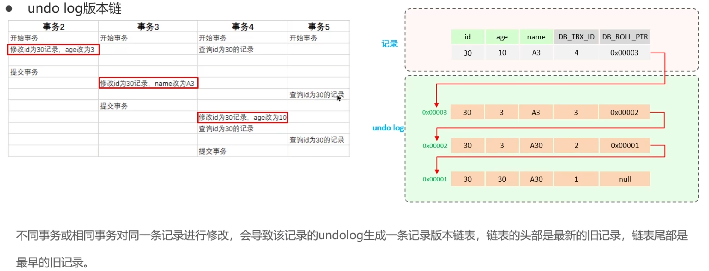
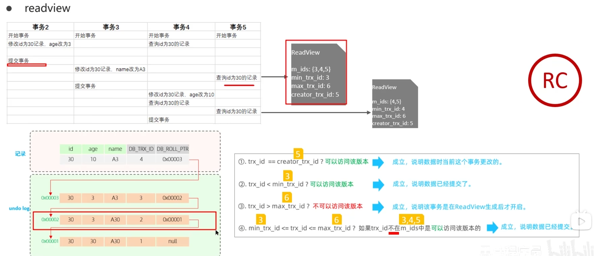

# MySql

## MySql 的引擎

- MyISAM：默认引擎，支持表级锁，速度快，支持全文索引，但不支持事务和外键约束。
- InnoDB：支持行级锁，支持事务和外键约束，性能较好，但速度比 MyISAM 慢。

## 为什么使用 InnoDB 作为默认引擎

- 支持事务：InnoDB 支持 ACID 事务，保证数据的一致性和完整性。
- 支持外键约束：InnoDB 支持外键约束，保证数据的完整性和一致性。
- 支持行级锁：InnoDB 支持行级锁，避免了表级锁带来的性能问题。
- 支持崩溃恢复：InnoDB 支持崩溃恢复，保证数据的安全性。

# MySql 索引

## B+树和 B 树的区别 为什么 innodb 使用 B+树作为索引结构

- B+树的所有值都在叶子节点上，非叶子节点只存储索引信息，B 树的非叶子节点也存储值。
- B+树的叶子节点通过指针双向相连，B 树的叶子节点不相连。
- B+树的查询效率更高，因为所有值都在叶子节点上，非叶子节点只存储索引信息，树更矮,减少了 IO 操作。
- B+树有大量冗余结点,插入删除效率更高

## 查询到 b+树的叶子节点后，如何找到对应的记录

数据页

## 什么情况下索引会失效

1. 使用 `LIKE` 模糊查询时以 `%` 开头

   - 示例：
     ```sql
     SELECT * FROM users WHERE name LIKE '%abc';
     ```
   - 原因：以 `%` 开头会导致无法使用索引，因为无法确定匹配的起始位置。

2. 查询条件中对索引列进行了函数操作

   - 示例：
     ```sql
     SELECT * FROM users WHERE YEAR(birth_date) = 1990;
     ```
   - 原因：对索引列使用函数或表达式会导致索引失效，因为索引存储的是原始值。

3. 查询条件中对索引列进行了隐式类型转换

   - 示例：
     ```sql
     SELECT * FROM users WHERE phone_number = 1234567890;
     ```
   - 原因：如果 `phone_number` 是字符串类型，而查询中传入的是数字，MySQL 会进行隐式类型转换，导致索引失效。

4. 使用 `OR` 条件且不是所有列都有索引

   - 示例：
     ```sql
     SELECT * FROM users WHERE name = 'John' OR age = 30;
     ```
   - 原因：如果 `name` 和 `age` 列中只有一个有索引，索引会失效。

5. 没有遵循最左匹配原则
   - 示例：
     ```sql
     SELECT * FROM users WHERE last_name = 'Smith' AND first_name = 'John';
     ```
   - 原因：如果 `last_name` 是复合索引的第一列，而查询中只使用了第二列，索引会失效。

## 索引优化

# 事务

## 事务的四个特性

- 原子性（Atomicity）：事务是一个不可分割的操作单元，要么全部成功，要么全部失败。
- 一致性（Consistency）：事务执行前后，数据的一致性必须得到保持。
- 隔离性（Isolation）：多个事务并发执行时，互不干扰，每个事务的执行结果对其他事务是不可见的。
- 持久性（Durability）：一旦事务提交，对数据库的修改是永久性的，即使系统崩溃也不会丢失。

## mysql 的 innodb 如何实现事务

- 持久性：使用日志文件（redo log）和数据页（data page）来保证数据的持久性。
- 原子性：使用 undo log（回滚日志）来实现原子性，记录事务的修改操作，可以在事务回滚时恢复数据。
- 隔离性：通过 mvcc（多版本并发控制）来实现隔离性，允许多个事务并发执行而不互相干扰。
- 一致性：通过锁机制和日志文件来保证数据的一致性，确保事务执行前后数据的一致性。

## mysql 的三种并发问题

- 脏读（Dirty Read）：一个事务 A 读取了另一个事务 B 未提交的数据（意味着事务 B 可能回滚，这样 A 读到的就是脏数据）。
- 不可重复读（Non-repeatable Read）：事务 A 读取事务 B 的数据后，事务 B 修改了数据并提交，导致事务 A 再次读取时结果不同。
- 幻读（Phantom Read）：一个事务在读取数据时，另一个事务插入了新数据，导致第一次读取和第二次读取的结果不一致。

## 事务的隔离级别

| 隔离级别                  | 脏读 | 不可重复读 | 幻读 | 实现机制                                 |
| ------------------------- | ---- | ---------- | ---- | ---------------------------------------- |
| 读未提交                  | √    | √          | √    | 直接读取数据，不加锁                     |
| 读已提交                  | ×    | √          | √    | Read View（每次读取创建新快照）          |
| 可重复读(innodb 的默认)   | ×    | ×          | √    | Read View（事务开始时创建快照） + 间隙锁 |
| 串行化 (对数据加入读写锁) | ×    | ×          | ×    | 悲观锁（读写锁）                         |

## mvcc 实现原理

mvcc 的实现基于三个组件:隐藏字段、undo log 和 readview

### 隐藏字段

每个数据行都有三个隐藏字段:

- DB_TRX_ID: 记录该行的创建事务 ID
- DB_ROLL_PTR: 记录该行的 undo log 指针
- DB_ROW_ID:隐藏的主键 ID

### undo log

回滚日志,在 insert、update、delete 操作时记录数据的旧值,用于回滚操作
insert 时,产生的 undolog 只在回滚时需要,事务提交后就可删除
update 和 delete 时,undolog 需要在事务提交后保留,用于 mvcc 的快照读取,所以不会立即删除

#### undo log 的版本链



### read view

#### 对比快照读和当前读

**当前读**: 直接读取最新版本的数据,需要加锁,会阻塞其他事务的读写操作
例如: SELECT ... FOR UPDATE, SELECT ... LOCK IN SHARE MODE(共享锁)

**快照读**: 读取当前事务的 readview,不加锁,不会阻塞其他事务的读写操作,但可能读取到旧版本的数据
例如: 简单的 SELECT 语句,不加锁的 SELECT 语句

对于读已提交 RC,每次 select 快照读都会创建一个新的 readview,读取最新版本的数据
对于可重复读 RR,开启事务第一个 select 语句是建立 readview 的地方(一个事务内的所有 select 语句都使用同一个 readview)

#### readview

readview 是快照读的原理,包含了当前事务的所有可见版本信息,包括:

- creator_trx_id: 创建 readview 的事务 ID
- min_trx_id: 当前活跃事务中最小的 ID
- max_trx_id: 当前活跃事务中最大的 ID+1(下一个事务 ID)
- m_trx_ids: 当前所有活跃事务的 ID 集

版本链数据访问规则:
在 undolog 中,对于每一行数据,DB_TRX_ID 记录的是最后一个修改该数据的事务,将它与当前事务的 readview 比较,判断当前事务能不能访问这个数据

1. DB_TRX_ID == creator_trx_id: 可以访问 因为是当前事务更改的这个数据
2. DB_TRX_ID < min_trx_id: 可以访问 因为这个事务已经提交了
3. DB_TRX_ID > max_trx_id: 不可以访问 当前事务创建 ReadView 之后才开始的事务修改了数据
4. DB_TRX_ID 在 min_trx_id 和 max_trx_id 之间: 需要判断 DB_TRX_ID 是否在 m_trx_ids 中,不在说明修改数据的事务已经提交
   

# MySql 日志

## 日志的分类

- redo log: 重做日志,用于事务提交后,保证数据的持久性,记录了每个事务对数据的修改操作,用于崩溃恢复
- undo log: 回滚日志,用于事务回滚和 mvcc 时,恢复数据的原始状态,记录了每个事务对数据的修改操作,用于撤销操作
- binlog: 二进制日志,用于数据的备份和恢复,记录了所有对数据库的修改操作,用于数据的增量备份和主从复制
- relay log: 中继日志,用于主从复制,记录了从主库接收到的 binlog,用于将主库的修改操作同步到从库

# MySQl 锁
