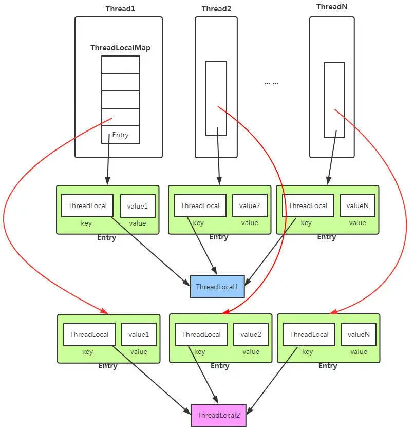
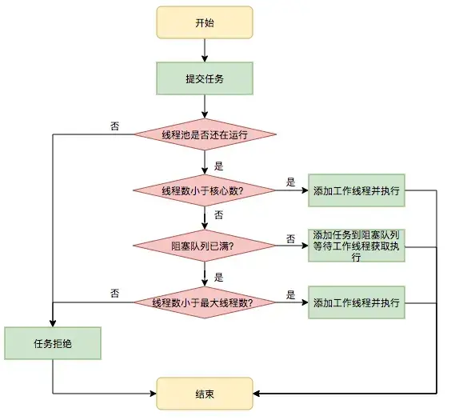

# JAVA JUC

## 怎么保证几个线程按顺序执行

### join()

```java
Thread t1 = new Thread(() -> System.out.println("线程1执行"));
Thread t2 = new Thread(() -> {
    try {
        t1.join(); // 等待t1执行完成
        System.out.println("线程2执行");
    } catch (InterruptedException e) { }
});
Thread t3 = new Thread(() -> {
    try {
        t2.join(); // 等待t2执行完成
        System.out.println("线程3执行");
    } catch (InterruptedException e) { }
});
t1.start(); t2.start(); t3.start();
```

### wait() notify() notifyAll()

wait() 是 Object 类的方法，必须在已获得对象锁的 synchronized 代码块中调用。

- 调用 wait() 时，线程释放当前持有的对象锁
- 线程进入对象的等待集合(wait set)中，暂停执行
- 其他线程可以获取该对象的锁并执行操作
- 当其他线程调用同一对象的 notify()/notifyAll() 时，等待的线程被唤醒
- 被唤醒的线程必须重新竞争获取锁才能继续执行

```java
class SharedResource {
    private boolean condition = false;

    public synchronized void waitForCondition() throws InterruptedException {
        while (!condition) {
            wait(); // 释放锁并等待通知
        }
        System.out.println("条件满足，继续执行");
        condition = false; // 重置条件
    }

    public synchronized void notifyCondition() {
        condition = true;
        notify(); // 唤醒一个等待的线程
        // 或 notifyAll(); // 唤醒所有等待的线程
    }
}
```

## sleep 和 wait 区别

| 特性     | Thread.sleep()           | Object.wait()                                    |
| -------- | ------------------------ | ------------------------------------------------ |
| 所属类   | Thread 类的静态方法      | Object 类的实例方法                              |
| 锁释放   | 不释放锁                 | 释放当前对象(this)锁(所以需要先获取当前对象的锁) |
| 唤醒方式 | 时间到期自动唤醒         | 需要其他线程调用 notify()/notifyAll()            |
| 使用场景 | 暂停执行，不涉及线程通信 | 线程间通信和协作                                 |

## synchronized 底层 (synchronized 也是可重入,但是不是公平锁)

对象头是 Java 对象在内存中的一部分，包含了运行时所需的元数据。每个 Java 对象都有对象头，不论对象大小。

Mark Word 是对象头的核心部分,对象第一次被 synchronized 上锁,会被分配一个 monitor,指向 monitor 的指针就在 Mark Word 记录

monitor 存储在 jvm 的本地内存,主要有三部分:

#### 1. Wait Set（等待集）

- 调用 wait() 的线程会释放锁并进入 Wait Set
- 这些线程处于 WAITING 或 TIMED_WAITING 状态
- 需要通过 notify()/notifyAll() 唤醒后重新竞争锁
- **被唤醒的线程不会立即执行，而是进入 Entry Set 重新竞争锁**

#### 2. Entry Set（入口集）存放等待获取对象锁的线程

- 当线程尝试进入 synchronized 代码块/方法时，如果锁已被占用，则进入 Entry Set
- 这些线程处于 BLOCKED 状态
- 当锁被释放时，JVM 会从 Entry Set 中选择一个线程获取锁并继续执行

#### 3. The Owner（拥有者）

- 同一时刻只能有一个线程成为 Owner
- Owner 线程可以多次进入同一个对象的 synchronized 块（可重入特性）
- Owner 线程退出 synchronized 块时释放锁，允许 Entry Set 中的线程竞争成为新的 Owner

Monitor 是重量级锁,基于操作系统的互斥量(Mutex)实现,涉及用户态和内核态的切换

#### 4. 重入计数器：记录 Owner 线程重入该锁的次数

## synchronized 使用

#### 1. 修饰实例方法 锁住的是当前实例对象（this）同一实例的所有 synchronized 方法不能被不同线程同时访问

```java
    public synchronized void increment() {
        count++;
    }
```

#### 2. 修饰静态方法 锁住的是类对象（Counter.class）同一类的所有静态 synchronized 方法不能被不同线程同时访问

```java
    public static synchronized void increment() {
        count++;
    }
```

#### 3. 修饰代码块 （对象锁）

进入代码段之前尝试获取锁,执行完后自动释放锁

```java
    private Object lock = new Object(); // 专用锁对象
    public void incrementWithLock() {
        synchronized(lock) { // 使用专用锁对象
            count++;
        }
    }
```

## reentrantLock 使用

相比synchronized,reentrantLock可以设置公平锁 非公平锁,超时机制,可以响应中断(解决死锁问题)
```java
// 创建公平锁
Lock fairLock = new ReentrantLock(true);
// 默认非公平
Lock lock = new ReentrantLock();
try {
    // 获取锁
    lock.lock();
    // 临界区代码
    count++;
} finally {
    // 确保释放锁
    lock.unlock();
}
```

## CAS 实现

CAS 操作包含三个操作数：
内存位置/对象（V）
预期原值（A）
新值（B）

## CountDownLatch
**等到计数器归零时，所有在await()处等待的线程才被释放(一次性)**
用于让一个或多个线程等待其他线程完成操作后再继续执行。
```java
CountDownLatch latch = new CountDownLatch(3); // 初始计数为3
// 等待线程
new Thread(() -> {
    try {
        latch.await(); // 等待计数器归零
        System.out.println("所有任务完成，继续执行");
    } catch (InterruptedException e) {}
}).start();

// 工作线程
for (int i = 0; i < 3; i++) {
    new Thread(() -> {
        // 执行任务
        latch.countDown(); // 计数器减1
    }).start();
}
```
## ThreadLocal

ThreadLocal 是 Java 提供的线程局部变量工具，允许每个线程拥有某个变量的独立副本，避免了共享变量的并发问题。简单来说，ThreadLocal 为每个线程创建了一个"私有的存储空间"。

### 1.ThreadLocal 使用

```java
private static ThreadLocal<String> threadLocal = new ThreadLocal<>();

    public static void main(String[] args) {
        // 线程1
        Thread thread1 = new Thread(() -> {
            // 线程1设置自己的ThreadLocal值
            threadLocal.set("线程1的数据");
            // 线程1获取自己的ThreadLocal值
            System.out.println("线程1获取值: " + threadLocal.get());
        });

        // 线程2
        Thread thread2 = new Thread(() -> {
            // 线程2设置自己的ThreadLocal值
            threadLocal.set("线程2的数据");
            // 线程2获取自己的ThreadLocal值
            System.out.println("线程2获取值: " + threadLocal.get());
        });
```

### 2.ThreadLocal 底层

每个线程拥有一个ThreadLocalMap,ThreadLocalMap内部使用Entry数组(table)存储数据,ThreadLocal是key，以弱引用方式存储.

ThreadLocalMap中通过当前线程和threadlocal查找到值
```java
public T get() {
    // 获取当前线程
    Thread t = Thread.currentThread();
    // 获取当前线程的ThreadLocalMap
    ThreadLocalMap map = getMap(t);
    if (map != null) {
        // 使用当前ThreadLocal对象作为key查找Entry
        ThreadLocalMap.Entry e = map.getEntry(this);
        if (e != null) {
            return (T)e.value;
        }
    }
    return setInitialValue(); // 未找到则设置初始值
}
```


## 线程池

### 1. 原理

### 2. 线程池核心线程数
CPU核数:N
- CPU密集型任务: N+1 (一个核上只能运行一个线程,如果线程数>>CPU核心数,会导致过多的上下文切换)

- IO密集型任务: 2N+1 (I/O密集型任务中，线程大部分时间在等待I/O操作完成, 当一个线程阻塞于I/O操作时，CPU核心可以调度另一个线程执行)

### 3. 拒绝策略
- CallerRunsPolicy，使用线程池的调用者所在的线程去执行被拒绝的任务
- AbortPolicy，直接抛出一个任务被线程池拒绝的异常
- DiscardPolicy，不做任何处理，静默拒绝提交的任务
- DiscardOldestPolicy，抛弃最老的任务，然后执行该任务