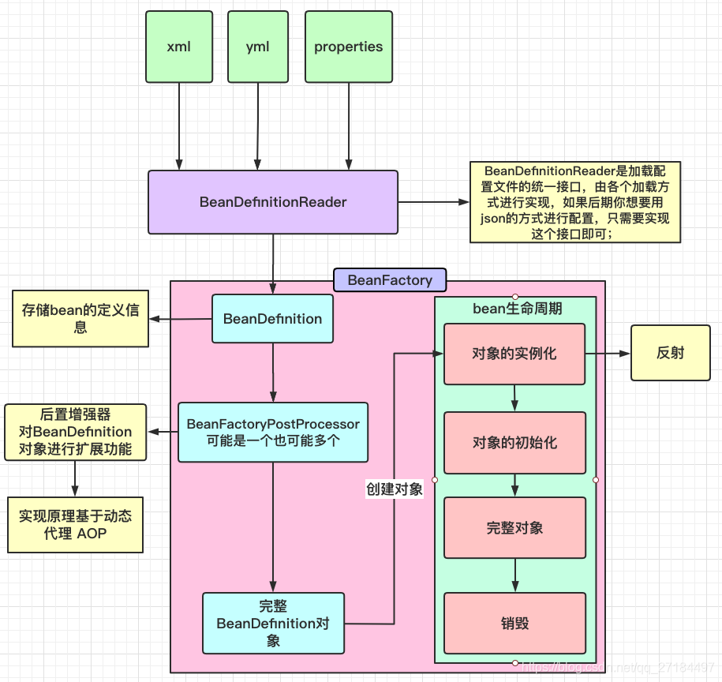

# Spring

- Spring框架核心特征包括:

1. Ioc容器 : 容器负责创建并管理对象（Bean），通过配置或注解来声明依赖关系，容器将所需资源（如其他 Bean）自动注入到目标对象中. 这样可避免对象显式地创建和查找依赖,解耦对象之间的依赖关系
2. AOP（面向切面编程）: 通过动态代理实现横切关注点（如事务管理、日志记录、权限控制） , 将横切逻辑与业务逻辑分离
3. 事务管理:  提供声明式和编程式事务管理。
4. Spring MVC（Web开发框架）

在 Spring 中，“Bean”指的是由 Spring 容器管理的对象。Spring 容器负责创建、配置、管理这些 Bean 的生命周期和依赖关系。

```java
@SpringBootApplication  //SpringBootApplication注解包含了@ComponentScan,因此会自动扫描对应包及子包下的所有 Spring Bean。
public class DemoApplication {
    public static void main(String[] args) {
        SpringApplication.run(DemoApplication.class, args);
    }
}
```

## 2.Bean 注册

@Component
用于标记通用组件，其他注解如 @Controller、@Service、@Repository 都是基于它的派生注解

如果要注册来自第三方的 bean,不能使用@Component,可以使用@Import @Bean
通过配置类手动创建并注册第三方组件为 Spring Bean

```java
@Configuration
public class ThirdPartyConfig {
    @Bean
    public Component thirdPartyComponent() {
        return new Component();
    }
}
```

## 3.Bean 生命周期



1. **加载 Bean 定义**

   - 读取并解析 `applicationContext.xml`（或扫描 `@Component` 注解的 Bean），将配置信息转换为 `BeanDefinition`。
2. **BeanFactoryPostProcessor**

   - 实现 `BeanFactoryPostProcessor` 接口，在 `postProcessBeanFactory` 方法中得到完整的 `BeanDefinition`。
3. **Bean 实例化**

   - 实例化前置
   - 实例化对象（分配内存，Spring 选择合适的构造方法，使用 **反射调用构造函数** 创建对象，但此时属性还未填充）
   - 实例化后置
   - 依赖注入：设置属性,将依赖的 Bean (@Autowired 的) 注入和装配。
4. **初始化**

   - 执行各种通知（如 `Aware` 接口）
     BeanNameAware：获取当前 Bean 在容器中的名称.BeanFactoryAware：获取当前 Bean 所在的 BeanFactory。
     ApplicationContextAware：获取所在的 ApplicationContext。
   - 执行初始化的前置方法 BeanPostProcessor#before
   - 执行初始化方法（若实现 InitializingBean 接口,实现重写的方法,或执行自定义的 init）
   - 执行初始化的后置方法 BeanPostProcessor#after ( **AbstractAutoProxyCreator（实现了 BeanPostProcessor 接口）会检查每个 Bean 是否需要被代理（是否有切面应用于它）如果需要代理，Spring 会根据情况选择代理技术** )
5. **使用 Bean**

   - 在程序中使用 Bean。
6. **销毁 Bean**

   - 将 Bean 对象进行销毁操作（如 `@PreDestroy` 或 `DisposableBean.destroy`）。

## 4. 依赖注入及方式

以下的方法会在bean初始化时自动执行,实现依赖注入

### 1. 构造函数注入

```java
@Service
public class UserService {
    private final UserRepository userRepository;
    @Autowired // 也可以省略@Autowired,因为只有一个构造函数
    public UserService(UserRepository userRepository) {
        this.userRepository = userRepository;
    }
}
```

### 2. Setter 注入

```java
@Service
public class UserService {
    private UserRepository userRepository;
    @Autowired
    public void setUserRepository(UserRepository userRepository) {
        this.userRepository = userRepository;
    }
}
```

### 3. 方法参数注入

```java
@Service
public class UserService {
    private UserRepository userRepository;
    @Autowired
    public void init(UserRepository userRepository) {
        this.userRepository = userRepository;
    }
}
```

### 4. 字段注入

```java
@Service 
public class UserService {
    @Autowired
    private UserRepository userRepository;
}
```

## AOP
AOP试图处理一些许多对象的有共性的具体功能(如日志、事务、权限等)，但他们又不是业务逻辑的一部分。

AOP基于动态代理技术，当调用一个对象的方法时，实际上是由代理对象拦截并执行该调用。
当我们配置一个 AOP 切面（如事务、日志、安全验证）时，Spring 会自动创建这些代理对象，拦截方法调用并在适当的时机执行我们定义的通知

动态代理技术允许我们在运行时动态的创建代理对象(而不是在编译时),分为两类:

1. JDK 动态代理: 只能对实现了接口的类进行代理, 通过反射机制创建一个实现了指定接口的代理对象,并将方法调用转发到目标对象上.
2. CGLIB 动态代理: 通过继承目标类创建代理对象, 通过字节码技术生成一个子类,并重写父类的方法,实现对目标对象的代理。CGLIB 适用于没有实现接口的类或需要对类进行增强的场景。

# Spring Boot
Spring Boot 是 Spring 的扩展, 旨在简化 Spring 应用程序的开发和配置。它提供了一种快速、约定优于配置的方式来创建独立的、生产级的 Spring 应用程序。
- 提供了开箱即用的功能（如嵌入式 Web 服务器tomcat、自动配置）。
- 通过约定优于配置的方式，减少了大量的配置工作。
- 提供了大量的开箱即用的 Starter 依赖，简化了 Maven 依赖管理,可以快速集成常用的库和框架(数据库、消息队列、缓存等)。

