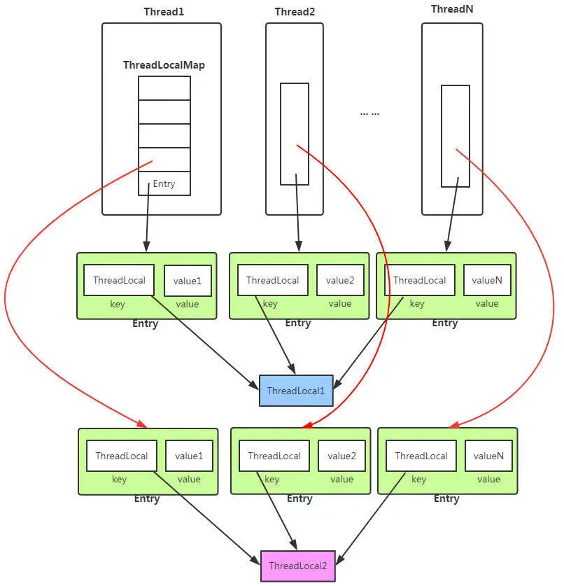

# 多线程应用场景

## 异步调用

# SpringBoot

在 Spring 中，“Bean”指的是由 Spring 容器管理的对象。Spring 容器负责创建、配置、管理这些 Bean 的生命周期和依赖关系。

## Bean 扫描

```java
@SpringBootApplication  //SpringBootApplication注解包含了@ComponentScan,因此会自动扫描对应包及子包下的所有 Spring Bean。
public class DemoApplication {
    public static void main(String[] args) {
        SpringApplication.run(DemoApplication.class, args);
    }
}
```

## Bean 注册

@Component
用于标记通用组件，其他注解如 @Controller、@Service、@Repository 都是基于它的派生注解

如果要注册来自第三方的 bean,不能使用@Component,可以使用@Import @Bean
通过配置类手动创建并注册第三方组件为 Spring Bean

```java
@Configuration
public class ThirdPartyConfig {
    @Bean
    public Component thirdPartyComponent() {
        return new Component();
    }
}
```

## Bean 生命周期

Insulindian

1. **加载 Bean 定义**

   - 读取并解析 `applicationContext.xml`（或扫描 `@Component` 注解的 Bean），将配置信息转换为 `BeanDefinition`。

2. **BeanFactoryPostProcessor**

   - 实现 `BeanFactoryPostProcessor` 接口，在 `postProcessBeanFactory` 方法中得到完整的 `BeanDefinition`。

3. **Bean 实例化**

   - 实例化前置
   - 实例化对象（分配内存，Spring 选择合适的构造方法，使用 **反射调用构造函数** 创建对象，但此时属性还未填充）
   - 实例化后置
   - 依赖注入：设置属性,将依赖的 Bean (@Autowired 的) 注入和装配。

4. **初始化**

   - 执行各种通知（如 `Aware` 接口）
     BeanNameAware：获取当前 Bean 在容器中的名称.BeanFactoryAware：获取当前 Bean 所在的 BeanFactory。
     ApplicationContextAware：获取所在的 ApplicationContext。
   - 执行初始化的前置方法 BeanPostProcessor#before
   - 执行初始化方法（若实现 InitializingBean 接口,实现重写的方法,或执行自定义的 init）
   - 执行初始化的后置方法 BeanPostProcessor#after ( **AbstractAutoProxyCreator（实现了 BeanPostProcessor 接口）会检查每个 Bean 是否需要被代理（是否有切面应用于它）如果需要代理，Spring 会根据情况选择代理技术** )

5. **使用 Bean**

   - 在程序中使用 Bean。

6. **销毁 Bean**

   - 将 Bean 对象进行销毁操作（如 `@PreDestroy` 或 `DisposableBean.destroy`）。

# MyBatis

# JAVA SE

## 反射

- 反射得到类的 class 对象,代表这个类本身. 每个类在 jvm 都仅有一个 class 对象,通过它可以获得类的接口、方法、属性等信息,可以调用方法
  可以用于

1. 框架开发 spring
2. 动态代理 (通过反射才能知道代理对象的签名,方法)
3. 注解处理

### 核心 API

Class 类：所有反射操作的入口点

```java
// 获取Class对象的三种方式
Class<?> cls1 = Class.forName("java.lang.String");
Class<?> cls2 = String.class;
Class<?> cls3 = "Hello".getClass();
```

Constructor 类：用于创建对象

```java
Constructor<?> constructor = cls.getConstructor(String.class);
Object obj = constructor.newInstance("测试");
```

Method 类：用于调用方法

```java
Method method = cls.getMethod("substring", int.class);
Object result = method.invoke(obj, 2);
```

Field 类：用于访问字段

```java
Field field = cls.getDeclaredField("value");
field.setAccessible(true); // 访问私有字段
Object value = field.get(obj);
```

## 动态代理

允许在运行时创建实现了一组给定接口的代理类，将方法调用转发到实际目标对象，同时可以在方法执行前后添加额外逻辑。

### JDK 动态代理

**基于接口实现，只能代理实现了接口的类。**

相比于静态代理

- 避免代码重复
  静态代理每个接口都需要手动实现所有方法
  若有 100 个方法，静态代理需要手写 100 段重复代码
  动态代理只需要一个 InvocationHandler 处理所有方法
- 运行时动态创建
  动态代理在运行时生成代理类，编译时不需要存在
  可以根据运行时条件决定是否代理及如何代理

```java
// 接口
public interface UserService {
    void save(User user);
    User find(int id);
}

// 目标实现类
public class UserServiceImpl implements UserService {
    @Override
    public void save(User user) {
        System.out.println("保存用户: " + user.getName());
    }

    @Override
    public User find(int id) {
        System.out.println("查询用户: ID=" + id);
        return new User(id, "用户" + id);
    }
}

// 创建JDK动态代理
public class JdkProxyDemo {
    public static void main(String[] args) {
        // 创建目标对象
        UserService target = new UserServiceImpl();

        // 创建代理
      <!--
      参数说明:
         - 第一个参数：目标类的类加载器
         - 第二个参数：目标类实现的接口数组
         - 第三个参数：InvocationHandler接口的匿名实现类
      InvocationHandler实现:
      - invoke方法在代理对象的任何方法被调用时执行
      - 在目标方法执行前后添加了日志输出
      - 通过method.invoke调用原始目标对象的方法
      -->
        UserService proxy = (UserService) Proxy.newProxyInstance(
            target.getClass().getClassLoader(),
            target.getClass().getInterfaces(),
            new InvocationHandler() {
                @Override
                public Object invoke(Object proxy, Method method, Object[] args) throws Throwable {
                    System.out.println("======方法执行前: " + method.getName() + "======");
                    Object result = method.invoke(target, args);
                    System.out.println("======方法执行后: " + method.getName() + "======");
                    return result;
                }
            }
        );

        // 调用代理方法
        proxy.save(new User(1, "张三"));
        User user = proxy.find(1);
    }
}
```

## AOP

在动态代理（包括 Spring AOP）中，当调用一个对象的方法时，实际上是由代理对象拦截并执行该调用。
当我们配置一个 AOP 切面（如事务、日志、安全验证）时，Spring 会自动创建这些代理对象，拦截方法调用并在适当的时机执行我们定义的通知

# JAVA JUC

## 怎么保证几个线程按顺序执行

### join()

```java
Thread t1 = new Thread(() -> System.out.println("线程1执行"));
Thread t2 = new Thread(() -> {
    try {
        t1.join(); // 等待t1执行完成
        System.out.println("线程2执行");
    } catch (InterruptedException e) { }
});
Thread t3 = new Thread(() -> {
    try {
        t2.join(); // 等待t2执行完成
        System.out.println("线程3执行");
    } catch (InterruptedException e) { }
});
t1.start(); t2.start(); t3.start();
```

### wait() notify() notifyAll()

wait() 是 Object 类的方法，必须在已获得对象锁的 synchronized 代码块中调用。

- 调用 wait() 时，线程释放当前持有的对象锁
- 线程进入对象的等待集合(wait set)中，暂停执行
- 其他线程可以获取该对象的锁并执行操作
- 当其他线程调用同一对象的 notify()/notifyAll() 时，等待的线程被唤醒
- 被唤醒的线程必须重新竞争获取锁才能继续执行

```java
class SharedResource {
    private boolean condition = false;

    public synchronized void waitForCondition() throws InterruptedException {
        while (!condition) {
            wait(); // 释放锁并等待通知
        }
        System.out.println("条件满足，继续执行");
        condition = false; // 重置条件
    }

    public synchronized void notifyCondition() {
        condition = true;
        notify(); // 唤醒一个等待的线程
        // 或 notifyAll(); // 唤醒所有等待的线程
    }
}
```

## sleep 和 wait 区别

| 特性     | Thread.sleep()           | Object.wait()                                    |
| -------- | ------------------------ | ------------------------------------------------ |
| 所属类   | Thread 类的静态方法      | Object 类的实例方法                              |
| 锁释放   | 不释放锁                 | 释放当前对象(this)锁(所以需要先获取当前对象的锁) |
| 唤醒方式 | 时间到期自动唤醒         | 需要其他线程调用 notify()/notifyAll()            |
| 使用场景 | 暂停执行，不涉及线程通信 | 线程间通信和协作                                 |

## synchronized 底层 (synchronized 也是可重入)

对象头是 Java 对象在内存中的一部分，包含了运行时所需的元数据。每个 Java 对象都有对象头，不论对象大小。

Mark Word 是对象头的核心部分,对象第一次被 synchronized 上锁,会被分配一个 monitor,指向 monitor 的指针就在 Mark Word 记录

monitor 存储在 jvm 的本地内存,主要有三部分:

#### 1. Wait Set（等待集）

- 调用 wait() 的线程会释放锁并进入 Wait Set
- 这些线程处于 WAITING 或 TIMED_WAITING 状态
- 需要通过 notify()/notifyAll() 唤醒后重新竞争锁
- **被唤醒的线程不会立即执行，而是进入 Entry Set 重新竞争锁**

#### 2. Entry Set（入口集）存放等待获取对象锁的线程

- 当线程尝试进入 synchronized 代码块/方法时，如果锁已被占用，则进入 Entry Set
- 这些线程处于 BLOCKED 状态
- 当锁被释放时，JVM 会从 Entry Set 中选择一个线程获取锁并继续执行

#### 3. The Owner（拥有者）

- 同一时刻只能有一个线程成为 Owner
- Owner 线程可以多次进入同一个对象的 synchronized 块（可重入特性）
- Owner 线程退出 synchronized 块时释放锁，允许 Entry Set 中的线程竞争成为新的 Owner

Monitor 是重量级锁,基于操作系统的互斥量(Mutex)实现,涉及用户态和内核态的切换

#### 4. 重入计数器：记录 Owner 线程重入该锁的次数

## synchronized 使用

#### 1. 修饰实例方法 锁住的是当前实例对象（this）同一实例的所有 synchronized 方法不能被不同线程同时访问

```java
    public synchronized void increment() {
        count++;
    }
```

#### 2. 修饰静态方法 锁住的是类对象（Counter.class）同一类的所有静态 synchronized 方法不能被不同线程同时访问

```java
    public static synchronized void increment() {
        count++;
    }
```

#### 3. 修饰代码块 （对象锁）

进入代码段之前尝试获取锁,执行完后自动释放锁

```java
    private Object lock = new Object(); // 专用锁对象
    public void incrementWithLock() {
        synchronized(lock) { // 使用专用锁对象
            count++;
        }
    }
```

## reentrantLock 使用

```java
// 创建公平锁
Lock fairLock = new ReentrantLock(true);
// 默认非公平
Lock lock = new ReentrantLock();
try {
    // 获取锁
    lock.lock();
    // 临界区代码
    count++;
} finally {
    // 确保释放锁
    lock.unlock();
}
```

## CAS 实现

CAS 操作包含三个操作数：
内存位置/对象（V）
预期原值（A）
新值（B）

## ThreadLocal

ThreadLocal 是 Java 提供的线程局部变量工具，允许每个线程拥有某个变量的独立副本，避免了共享变量的并发问题。简单来说，ThreadLocal 为每个线程创建了一个"私有的存储空间"。

### 1.ThreadLocal 使用

```java
private static ThreadLocal<String> threadLocal = new ThreadLocal<>();

    public static void main(String[] args) {
        // 线程1
        Thread thread1 = new Thread(() -> {
            // 线程1设置自己的ThreadLocal值
            threadLocal.set("线程1的数据");
            // 线程1获取自己的ThreadLocal值
            System.out.println("线程1获取值: " + threadLocal.get());
        });

        // 线程2
        Thread thread2 = new Thread(() -> {
            // 线程2设置自己的ThreadLocal值
            threadLocal.set("线程2的数据");
            // 线程2获取自己的ThreadLocal值
            System.out.println("线程2获取值: " + threadLocal.get());
        });
```

### 2.ThreadLocal 底层

每个线程拥有一个ThreadLocalMap,ThreadLocalMap内部使用Entry数组(table)存储数据,ThreadLocal是key，以弱引用方式存储.

ThreadLocalMap中通过当前线程和threadlocal查找到值
```java
public T get() {
    // 获取当前线程
    Thread t = Thread.currentThread();
    // 获取当前线程的ThreadLocalMap
    ThreadLocalMap map = getMap(t);
    if (map != null) {
        // 使用当前ThreadLocal对象作为key查找Entry
        ThreadLocalMap.Entry e = map.getEntry(this);
        if (e != null) {
            return (T)e.value;
        }
    }
    return setInitialValue(); // 未找到则设置初始值
}
```

